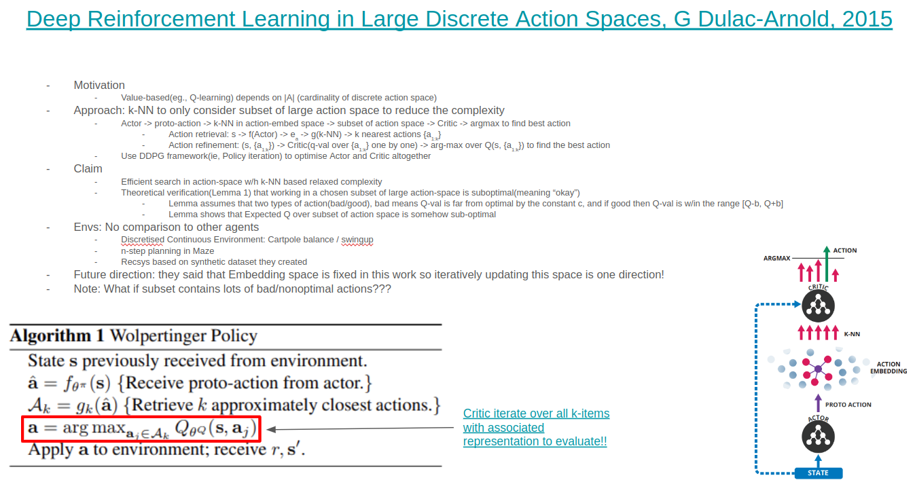
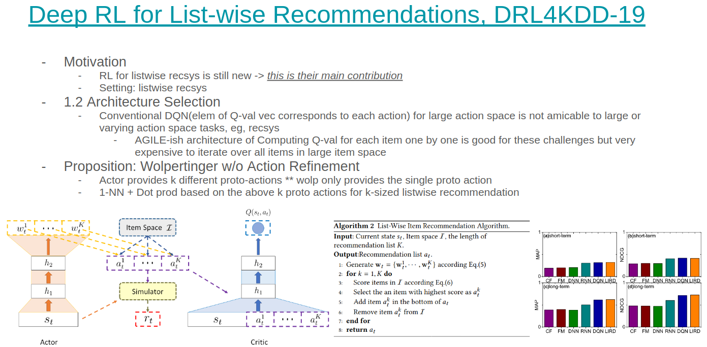
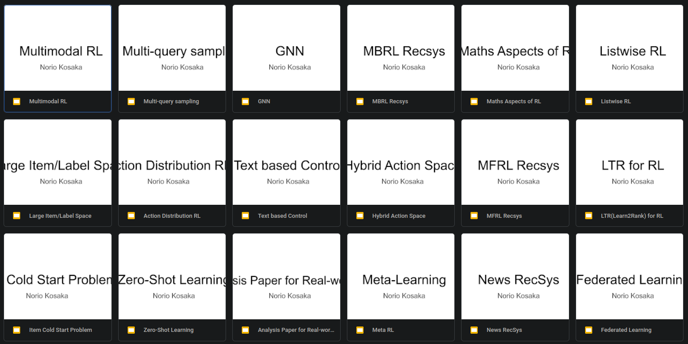

# Introduction

- I have literally learnt a lot from my great mentor, [Ayush Jain](https://ayushj240.github.io/). He shared not only tips but also many of useful links to learn from.

# Types of papers: Quote from [Ayush Jain](http://www-scf.usc.edu/~ayushj/)

- Paper’s contribution is msg about one key idea that is new and important. There seem to be 2 main kinds of contributions you could make with your paper;
  1. Problem proposing paper -> "Why your problem setting is interesting?"
     - Identify a new problem setup that is meaningful for current or future research applications.
     - Contribution is the novel problem itself and the method you propose will be new (ie, SOTA) by definition.
  2. Methodological paper -> "Why your method is interesting?"
     - Identify a problem/issue in the existing methods and propose a solution to tackle that issue.
     - If your hypothesis is correct, then you would naturally beat the SOTA.
       - But beating SOTA is not the main point. Contribution is still about the problem you identified and solved.  
       ** SOTAs come and go, but ideas are transferable and reusable.

- Other ways to make research contributions;
  - Rigorously analyzing issues in what works and what doesn’t
  - Benchmarking current algorithms to offer meaningful insights,
  - Novel datasets or environments that further the frontier of research.

# Project Procedures

- Research storyline

  - Literature review to Find the candidate topics

    - Objective: To understand the prior works and form a candidate project idea

      - To determine what is known and not known about a subject, concept or problem in the area
      - To generate useful research questions for the discipline
      - To determine an appropriate experimental design to answer the research question

    - Compile a list of papers or blog posts by scanning

      - Twitter / ML posts on Reddit / Conferences(eg., NIPS/ICML/ICLR) / Friends / Deep Learning Monitor / Arxiv Sanity reserver / Google Blog etc...

      - Interesting example about how to select relevant papers

        > Get the gestalt right. I remember being impressed with Fei-Fei (my adviser) once during a reviewing session. I had a stack of 4 papers I had reviewed over the last several hours and she picked them up, flipped through each one for 10 seconds, and said one of them was good and the other three bad. Indeed, I was accepting the one and rejecting the other three, but something that took me several hours took her seconds. Fei-Fei was relying on the gestalt of the papers as a powerful heuristic. Your papers, as you become a more senior researcher take on a characteristic look. An introduction of ~1 page. A ~1 page related work section with a good density of citations - not too sparse but not too crowded. A well-designed pull figure (on page 1 or 2) and system figure (on page 3) that were not made in MS Paint. A technical section with some math symbols somewhere, results tables with lots of numbers and some of them bold, one additional cute analysis experiment, and the paper has exactly 8 pages (the page limit) and not a single line less. You’ll have to learn how to endow your papers with the same gestalt because many researchers rely on it as a cognitive shortcut when they judge your work. [From "A Survival Guide to a PhD" by Andrej Karpathy](http://karpathy.github.io/2016/09/07/phd/)

    - Paper-reading check list: Multiple paths in reading papers to check the following

      - What did the authors try to accomplish? => To clarify the storyline
      - What were the key elements of the approach? => To understand the contributions
      - Any new applications? => To think about where it comes useful and not
      - Any connection to other works that you know? => To categorise the paper along with others
      - What other references fascinate you to follow? => To find a next paper to go over

    - How to summarise papers?

      - I'd like to summarise papers on Google slide since it's quicker to remind myself about the paper content. See the following;
        - 
        - 
      - Other formats: [Prof. Yoichi Ochiai's template](https://www.slideshare.net/Ochyai/1-ftma15?ref=https://www.chem-station.com/blog/2017/12/shoroku.html) / [Arxiv Times](https://github.com/arXivTimes/arXivTimes)
        
    - Organise/categorise the related works
    
      - Of course, mendeley or other reference mgrs are okay but didn't work for me... So here is my way;
        - 
    
    - Make sure to check the codebase
    
      - If you have time, then run the existing open-source code / Try implementing it yourself to understand it better
      
    - Discuss with co-workers after going over a few seemingly relevant papers
    
      - Discussing with ppl helps you to understand them better and you might be able to get some new interesting questions from your co-workers
      - Make sure to take note of the discussion!!
      
    - Tips: `What does "Carefully read a paper"` mean? by `Ayush`
    
      - Analyse the exps results to see if the proposed method really works or it has some flaw
      - Check if the proposition is evaluated correctly through exp results
      - See if the paper is critical to the project from various perspectives
        - eg., What's our contribution? what can we improve? any limitation
    
  - Looking around yourself to find real-world issues is important
  
    - Lit review is good but sometimes just listening to your coworkers helps you to find the practical issues of existing methods too!
    
  - Draft the storyline
    - Prepare the following slides as a very short form of paper while working on the next todo(ie, Init exp)
      - Motivating example + Problem Setting: To explain the importance of project
        - Explain a kind of task using generic RESEARCH FRIENDLY technical terms, eg., Varying action RL where a set of available actions changes over time
          - generic RESEARCH FRIENDLY technical terms: common technical language that everybody is familiar with to reduce ambiguity
        - Explain a real-world scenario to show where it comes useful
          - Ideally the task you are going to work on should have the potential impact in real-world
      - Prior / Relevant approaches
        - Use the developed categorisation to explain the previous approaches
      - Problem statement and Technical challenges
        - Problem statement is the insight about the problem setting, eg., Relational reasoning over available actions is crucial
        - Technical challenges are issues that you need to work on to achieve the problem statement; For instance,
          - Action Space as Input for Varying Action Space
            - **Candidate set** can vary across episodes / timesteps
          - Modelling Action Interdependence
            - Make decision based on the **relational information among interdependent actions**
      - Potential solution
        - Given the challenges, you can explain your potential solution
        - ** Brainstorm the issues of baselines and potential solutions
	- Brainstorm the method's applicability
  	   - Where does your method come beneficial?
	   - Any real-world application?
	   - Don't limit yourself to the existing envs, but think out of the box about new applications
      - Experimental plan
        - Applications / Envs / Datasets
        - Research Questions to effectively show the contribution of your proposition
        - Oracles / Baselines => See [his blog](https://ofirnachum.github.io/posts/baselines-and-oracles/)
        - Quantitivate / Qualitative results
  - Tips by Ayush
    - Brainstorm with more depth of interleaving questioning and answering, don't stop with the first layer of questions in idea generation
      - top-down: start with the problem, narrow it down to the solution space
      - bottom-up: start from specific insights, and go upwards to solve bigger family, more universal problems
    - Constant thinking and reading to refine the process
    - Impactful problem??
      - Hot topic, not low-hanging fruit (ie., high significance)
      - Impactful applications
      - Impactful and reachable storyline
  
- Experiments
  - Selection of env/task/dataset
	- Think about if the existing env offers such challenge correctly and or too artificial
  - Init exp: POC to verify hypothesis/insight and the codebase
    - Make sure to Explore to get insights about the problem => Refine the problem statement
    - Debug: (i) code-level debug to identify bugs, (ii) idea or assumption-level debug to identify the flaw in your claim
    - [Good reference](https://ofirnachum.github.io/posts/baselines-and-oracles/)
    - Make sure that agents/models are fully tuned!! Also, try extreme hyperparams, eg., lr=0.1 or gamma=0.0 etc to robustify the results!
  - Full-scale experiments across different datasets/envs
	  - Clarify lear exp storyline to analyse the contribution of our proposition
		  - See if what to propose and the contribution / challenges to do it are clear
	- Try all the possible degree of complexity on the task to see when the prior works fail at the early stage of project
	- Play with all hyper-params with 2/3 levels to find the sensitive param
  - Compile the qualitative/quantitative results
    - Make sure to tune the baselines fully!!
    - Hyper-param search of your method to realise the optimal performance
    - Clean up the codebase periodically to avoid some legacy code chunks causing unexpected behaviour

- Paper-writing

  - Quotes from Ayush
    - The general procedure for intro writing depends on the kind of paper it is. It usually requires a lot of trial and error to find out the best version to explain your idea, so there’s no single solution that fits everywhere. Here’s the way that worked for his two papers, where he proposed a new problem framework(ie, Problem Proposing paper of above).
      - Intuition paragraph: Give an intuitive example of what your problem is and how we as humans solve that problem. It is a setup for the whole paper.
        Problem paragraph: State your problem setting. Differentiate it from general prior work and specific prior work that could potentially be applicable for this problem. Finally, state your problem goal clearly.
      - Importance of this problem: Why are we solving this problem? What will this achieve if we can solve it successfully? Since we mention applications already here, we can also talk about the environments we tackle in our paper, to emphasize what we have been able to achieve by solving this problem.
      - Challenges in solving this problem: List all the technical challenges required to solve this problem.
      - Solution: What is your solution to these challenges? — Describe your method in simple terms, yet focusing on the important novel components.
      - Contributions: Clearly state what is new in your paper. Why should a reader care about your paper? Keep it short and focused, instead of writing everything possible. e.g. We identified this problem, proposed a solution with this insight, and this enables us to solve these applications.
      - Important points:
        - everything should follow one coherent story. Carefully think about the sentence flow (low-level) and paragraph flow (high-level).
        - keep the intro as short and concise as possible. Don’t add any detail that is not important — even if you took the longest time to figure that detail out.
        - re-read everything as a new reader. Does everything make perfect sense? If something is hand-wavy, then clarify it or minimize it if you know that there is nothing you can do to make it clearer.
  - Tips
	  - Try to re-think from the new reader perspective when reading own writing, e.g., Intro
	    - knowing when intro is done is very hard
	    - consistency b/w lines is important -> smooth transition in storyline
	    - concise/ctirical writing <- practise by writing alot
	  - what makes a good research paper
	    - Theoritical background
	    - interesting insight
	    - through evaluation/analysis/comparison
	    - well-written, the research question is concise and the results are clear
	    - novel approach
    - Keep thinking how to improve the project
      - Instead of thinking about more method applicability and more future research directions
      - Look at all the possible solutions and organise what is working and not working
      - Zoom-out: Think from the problem perspective to improve instead of method perspective to build up
  - Generic paper structure
    - Introduction
    - Relevant Works
    - Problem Setting
      - Setting where env requires our assumption
      - Our hypothesis and Prior exp to verify it
    - Proposition
    - Exprements
      - Research Question
      - Envs
      - Agents / Baselines
    - Conclusion
    - Appendix

# Other tips

- Slide Prep tips for research presentation by Ayush
  - Be wary of how to make it visually appealing. For example, using red colour in text is not so pleasing. You can try bold or some other colour that is easier on the eye.
  - Think from the perspective of a new viewer who has no idea about our project
    - How can we make them understand the important parts in the easiest manner?
  - Wherever we can explain something with videos, or transitions or an animated build-up of figures, do it
  - Make results look more attractive but be faithful!!
  - Key words: Conciseness / Clarity / Perspective of a new viewer / Presentation / Aesthetics
- Code submission prep todos by Ayush
  - Remove non-anonymous references: name(individual / company / team / server name / etc)
  - Add requirements, experiments, analyses cmds to README
  - Add brief intro to the beginning and quantitative results to the end of README.md
  - Remove any unnecessary files that are not used anywhere. This requires a pass-through of the entire codebase.
  - Delete all __pycache__ folders
  - Finally, git pull in a new folder, delete .git and .gitignore and then make the zip file to upload
- Rebuttal tips: [Reference](https://deviparikh.medium.com/how-we-write-rebuttals-dc84742fece1)
  - Start positive
  - Order matters
  - Let reviewers speak for themselves, then respond directly
  - Be conversational
  - Respond to the intent of the questions
  - Don't be afraid of emphasis
  - Feel free to set the stage
  - Keep things self-contained
  - But get credit for details you already included
  - Consolidate common concerns
  - Colour-code reviewers
  - Stats speak louder than words
  - Don't promise, do!
  - Be receptive and reasonable
  - Be transparent
  - Shine a spotlight on reviewers acting in bad-faith
  - Acknolwdge reviewer efforts
  - Don't forget the humans on the other end
- How to present a poster at a conference?: [Link](https://twitter.com/jbhuang0604/status/1518097856325996545)
  - *Be Welcoming*
    - Stand by the side of the poster.
    - Never face the poster and turn your back on your audience.
    - Actively approach people walking by.
  - *Be Enthusiastic*
    - If you do not sound excited about your work, why should others be excited? Hype yourself up! People can feel the positive energy and will be willing to learn more about your work.
  - *Be Early and Stay Late*
    - There are fewer people *before* and *after* the scheduled poster session. Don't miss the great opportunity to have interesting, long conversation with people genuinely interested in your work.
  - *Be Concise*
    - Bad: Present linearly from top to bottom for 10 mins. 
    - Good: Present an elevator pitch for 30 seconds. Hook the audience and then respond to any questions.
  - *Use Tools*
    - Poster is just a *static* visual abstract. If your work involve other *dynamic* mediums (e.g., video, sound), bringing a laptop or tablet would make your presentation a lot more engaging.
  - *No "Do you know X?"*
    - Yes, your intention is good, but this only makes other people feel dumb.
    - Give a 10 sec background about X and then focus on *your work*.
  - *Handout*
    - Print several mini-poster as handout so that you can give people who are interested in learning more. Make sure that the poster has link/barcode that refer them to your project page.
  - *Build Your Network*
    - Thank *each* person for stopping by your poster and/or asking good questions.
    - Say their name (or ask how to pronounce their name).
  - *Bring People to Your Poster*
    - Senior folks: Bring other senior people you know to your students' poster!
    - Nothing is more validating than presenting your work to researchers whom you look up to.
  - *Make a Good Poster*
    - All the presentation tips won't work if you have a crappy poster.
- Mentoring Tips: How to mentor Phd student and how to Feedback
  - Be constructive
    - Give the alternative idea when you discuss, don't just say that it's bad
  - Listen carefully
    - They might have thought of something that I've never thought of!
  - Don't control too much, find the middle ground via discussion
    - Try to keep the direction as original as possible, i.e., the direction that he/she wants to
- Work Log System
  - In order to keep track of the progress of your research project, some people discuss how to efficiently do this as follows;
    - [Matthew Rahtz's blog](http://amid.fish/reproducing-deep-rl) / [John Schulman](http://joschu.net/blog/opinionated-guide-ml-research.html)
- What is good research?(I know this is super open-ended question.... but here are some links)
  - https://www.richmond.gov.uk/media/5417/research_proposal_guide.pdf
  - http://www.uh.edu/~lsong5/documents/A%20sample%20proposal%20with%20comment.pdf
  - https://gred.seisa.ac.jp/kyouikugaku/nyushi/guideline1/?action=common_download_main&upload_id=766
  - https://pdfs.semanticscholar.org/db8c/ee0bd64268a75f0a8f02cc446223ce9ceeed.pdf
  - http://www.phd-dauin.polito.it/proposals.php#44
- How to read theoretical CS papers: [Link](https://cstheory.stackexchange.com/questions/45722/how-to-efficiently-read-the-theoretical-computer-science-research-papers/45735#45735?newreg=dc0b5f7290cb4289a7de61e6f4124f3c)
  - Once we sort out the relevant paper then get to the bottom of it using the 3 pass method or other.
  - Usually, proofs are built up from some simple original work. So readign chronologically helps you to start with the core idea.
- Tips of paper structure: [link](https://docs.google.com/document/d/1o9rqRaALSpvCs1Psu-IHVdt2gflhIodCV9MD1dApfLk/edit?usp=sharing)

## Writing tips: Ayush shared me [this website](https://raghavan.usc.edu/2021-spring-crafting-a-research-agenda/#:~:text=%2D-,M%204/5%0AWriting,-%2D)
- [The Craft of Writing Effectively, McEnerney](https://www.youtube.com/watch?v=vtIzMaLkCaM)  
  - (1) Think about who your readers are and what value your writing offers to them,
  - (2) Use the code/terms commonly used in the community to illustrate the value to readers
    - Otherwise ppl don't care about your work/writing BECAUSE they can't find the motivation to read _not because_ your work/writing is bad/valueless/trivial/not-original
  - ** There are lots of better and longer summary in the comment like [the one of Lei Xun](https://www.youtube.com/watch?v=vtIzMaLkCaM&lc=UgwQEwbaFU1DJ9YOq5N4AaABAg)
- [Blog of Josh Marshall about the great guy, Grant](https://www.orwellfoundation.com/the-orwell-foundation/orwell/essays-and-other-works/politics-and-the-english-language/)
  - Clarity in writing is important
    - Clarity: A sentence with the fewest well-chosen words, but would not sacrifice meaning to the construction of high-sounding sentences
    - He and other generals like Zachary Taylor were able to obtain this clarity through their duty of sending commands out to different roles of people during the war
  - Sentence can be as clear as the idea in your mind. Thus, you have to have iteration to refine the idea first before writing
